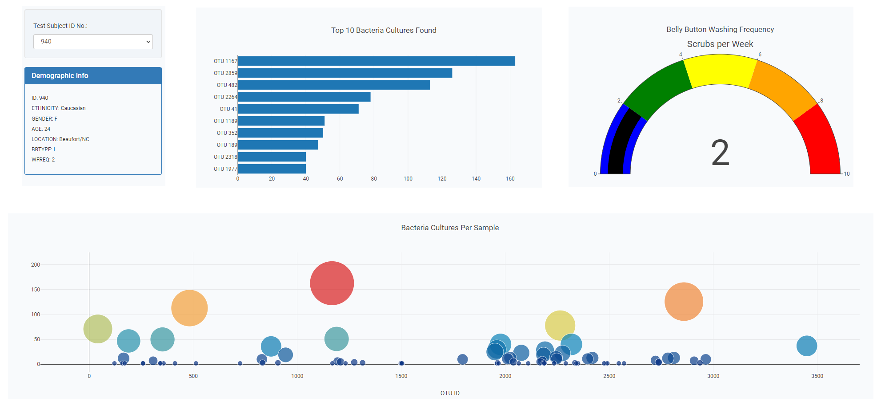
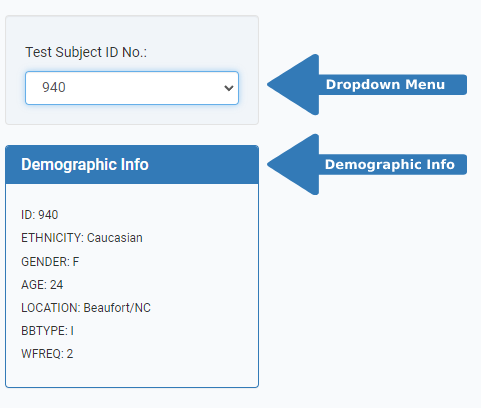
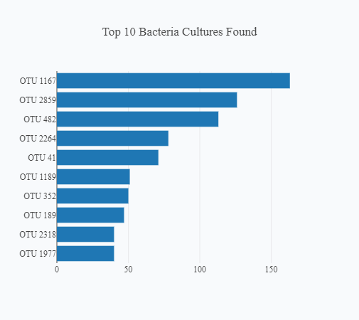
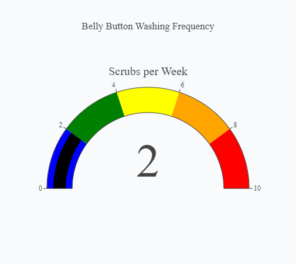
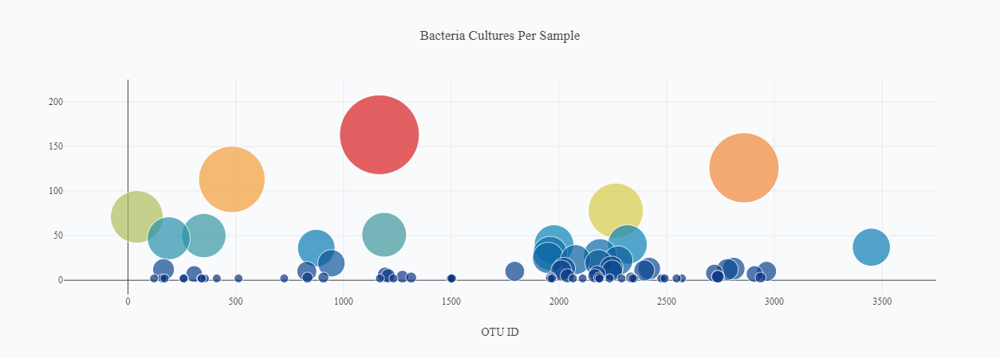

# Belly Button Biodiversity

## Dashboard
[Click here to view the live project!](https://matin-n.github.io/Belly-Button-Biodiversity/)

## Purpose
This project constructs a dashboard to implement data visualization for the types of bacteria within belly buttons within each volunteer. The dataset is anonymized, and each volunteer is assigned a unique ID number. The volunteers are able to identify the top 10 bacterial species in their belly buttons.

- Data visualizations that are attractive, accessible, and interactive
- Manipulate, parse, and transform data in JSON format
- Interactive features such as dropdowns, buttons, and retrieval of data from external sources
- Deploy an interactive chart to GitHub Pages

## How To Use
Select a ID number from the dropdown menu to populate the demographic information and display visualizations.

Demographic Information

When a volunteer ID is chosen from the dropdown menu, that person's demographics information, such as location, sex, and age, will be displayed:

Visualizations

### Top 10 Bacterial Species (OTUs)
When a volunteer ID is selected from the dropdown menu, that person's top 10 bacterial species (OTUs) are displayed in a horizontal bar chart:

### Belly Button Washing Frequency
When a volunteer ID is selected from the dropdown menu, that person's weekly washing frequency is displayed as a measure from 0-10 in a gauge chart:

### Bacteria Cultures Per Sample
When a volunteer ID is selected from the dropdown menu, that person's bacteria culture per sample (otu_ids as x-axis & sample_values as y-axis) is displayed as a bubble chart:

## Resources
- Data Source: [`samples.json`](samples.json)
- Source Code: [`charts.js`](static/js/charts.js), [`index.html`](index.html)
- Libraries: [`D3.js 7.3.0`](https://d3js.org/), [`Plotly.js 2.8.3`](https://plotly.com/javascript/), [`Bootstrap 3.4.1`](https://getbootstrap.com/docs/3.4/)
